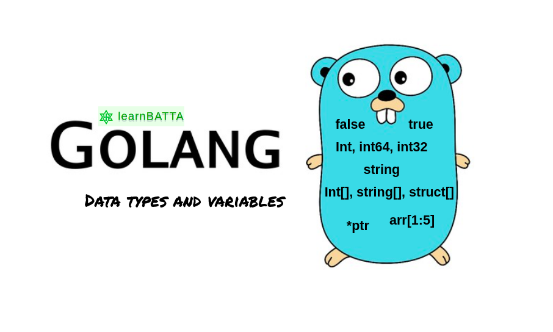

# Go Tooling and Variables

Let's explore the essential Go tools and delve deeper into variable declarations in Go.



## Go Tooling

Go provides a robust set of tools for managing your source code, building, testing, and more. Here are some of the key Go tools:

```bash
go build
```

- The `go build` command compiles a Go program or a list of packages.
- It creates an executable for the main package.
    - On Windows, it appends a .exe suffix to the executable.

-----

```bash
go doc

// example
go doc fmt
```

- `go doc` prints documentation for a specified package.

-----

```bash
go fmt
# example 
go fmt mycode.go
```

- `go fmt` formats source code files, adhering to Go's recommended code style.
- It indents code and breaks down overly long lines for improved readability.

-----
```bash
go get
# example
go get github.com/example/package
```

- go get downloads packages and installs them into your Go workspace.
- It automatically manages dependencies for your projects.

-----

```bash
go list
# example
go list -m all
```

- go list shows all installed packages in your Go environment.

-----

```bash
go run
# example
go run myprogram.go
```

- go run compiles `.go` files and runs the resulting executable in one step.

-----

```bash
go test
# example 
go test mytests_test.go
```

- go test is used for running tests in Go. It executes test functions in files ending with _test.go.

-----

## Variable Declarations in Go

In Go, variable declarations are explicit, and the type of a variable must be specified. Here are some basic and advanced variable declaration examples:

```go
var x int
var x, y int // multiple declarations
```

Type declarations allow you to create type aliases:

```go
type Kelvin float64
type IDnum int
```

Now, you can declare variables using these type aliases:

```go
var employee_id IDnum
// or initializing the variable

var pid IDnum = 1000
```

You can also omit the type, and Go will infer it from the value assigned:

```go
var x = 100
```

This will deduce/assume that you are using an `int`. 

Uninitialized variables are set to their zero values:

```go
var x int    // x is 0
var x string // x is ""
```

Short variable declarations are commonly used within functions:

```go
x := 100 // Type is inferred as int
```

Variables declared using short declarations take their types from the expressions on the right-hand side.

These tools and variable declaration techniques are fundamental to working effectively with Go, whether you're building small programs or large-scale applications.